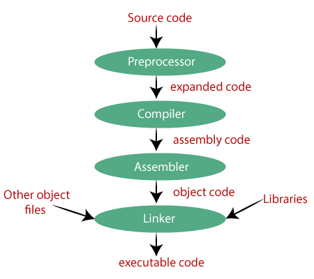

# Introducing C++
C++ is leveraged by millions of programmers around the world. It ’ s one of the most popular languages for writing computer applications — and the most popular language for writing big-budget computer games.

## Creating an Executable File

The file that you run to launch a program — whether you ’ re talking about a game or a business application — is an executable file . There are several steps to creating an executable file from C++ source code (a collection of instructions in the C++ language). The process is illustrated in

1. First, the programmer uses an editor to write the C++ source code, a file that usually has the extension .cpp . The editor is like a word processor for programs; it allows a programmer to create, edit, and save source code. 
2. After the programmer saves a source file, he or she invokes a C++ compiler — an application that reads source code and translates it into an object file . Object files usually have the extension .obj . 
3. Next, a linker links the object file to any external files as necessary, and then creates the executable file, which generally ends with the extension .exe . At this point, a user (or gamer) can run the program by launching the executable file.

To help automate this process, it ’ s common for a programmer to use an all-in-one tool for development, called an `IDE ( Integrated Development Environment )`. An IDE typically combines an editor, a compiler, and a linker, along with other tools.

## Dealing with Errors
- **Compile errors**. These occur during code compilation. As a result, an object file is not produced. These can be syntax errors , meaning that the compiler doesn ’ t understand something. They ’ re often caused by something as simple as a typo. Compilers can issue warnings, too. Although you usually don ’ t need to heed the warnings, you should treat them as errors, fix them, and recompile.

- **Link errors**. These occur during the linking process and may indicate that something the program references externally can ’ t be found. These errors are usually solved by adjusting the offending reference and starting the compile/link process again. 

- **Run-time errors**. These occur when the executable is run. If the program does something illegal, it can crash abruptly. But a more subtle form of run-time error, a logical error , can make the program simply behave in unintended ways. If you ’ ve ever played a game where a character walked on air (that is, a character who shouldn ’ t be able to walk on air), then you ’ ve seen a logical error in action.

# Writing Your First C++ Program

## Commenting Code
Comments are completely ignored by the compiler; they ’ re meant for humans. They can help other programmers understand your intentions. But comments can also help you. They can remind you how you accomplished something that might not be clear at first glance.
You can create a comment using two forward slashes in a row ` // `. Anything after this on the rest of the physical line is considered part of the comment.

## Using Whitespace 
The next line in the program is a blank line. The compiler ignores blank lines. In fact, compilers ignore just about all whitespace — spaces, tabs, and new lines. Like comments, whitespace is just for us humans.

## Including Other Files

`#include <iostream>` 

The preprocessor runs before the compiler does its thing and substitutes text based on various directives. In this case, the line involves the #include directive, which tells the preprocessor to include the contents of another file.

## Defining the main( ) Function

`int main()` 

A function is a group of programming code that can do some work and return a value. In this case, `int` indicates that the function will return an integer value. All function headers have a pair of parentheses after the function name. 

All C++ programs must have a function called `main()` which is the starting point of the program. The real action begins here.

## Terminating Statements 

You ’ ll notice that the first line of the function ends with a semicolon ( ; ). That ’ s because the line is a statement — the basic unit controlling the execution flow. 
All of your statements must end with a semicolon — otherwise, your compiler will complain with an error message and your program won ’ t compile.

## Displaying Text through the Standard Output 

The first line in the body of `main()` displays `Hello World!` , followed by a new line, in the console window. 

`std::cout << "Hello World!" << std::endl;` 

*"Hello World!"* is a string — a series of printable characters. Technically, it ’ s a string literal , meaning it ’ s literally the characters between the quotes. 

`cout` is an object, defined in the file iostream , that ’ s used to send data to the standard output stream. In most programs (including this one), the standard output stream simply means the console window on the computer screen. 

I use the *output operator ( << )* to send the string to *cout* . You can think of the output operator like a funnel; it takes whatever ’ s on the open side and funnels it to the pointy side. So the string is funneled to the standard output — the screen.

I use `std` to prefix *cout* to tell the compiler that I mean *cout* from the standard library. *std* is a **namespace** . You can think of a namespace like an area code of a phone number — it identifies the group to which something belongs. You prefix a namespace using the **scope resolution operator ( :: )**. 

Finally, I send `std::endl` to the standard output. *endl* is defined in *iostream* and is also an object in the *std* namespace. 

Sending `endl` to the standard output acts like pressing the Enter key in the console window. In fact, if I were to send another string to the console window, it would appear on the next line.

## Returning a Value from main( ) 
The last statement in the function returns 0 to the operating system.

`return 0;`

Returning 0 from main() is a way to indicate that the program ended without a problem. The operating system doesn ’ t have to do anything with the return value. In general, you can simply return 0 like I did here.