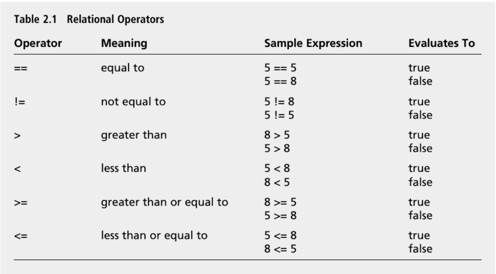

# Forks in the Road: Comparing, Deciding. 

## Introduction:
So far, the programs you ’ ve seen have been linear — each statement executes, in order, from top to bottom. However, to create interesting games, you need to write programs that execute (or skip) sections of code based on some condition. That ’ s the main topic of this chapter. Specifically, you ’ ll learn to:

- Understand truth (as C++ defines it) 
- Use *if* statements to branch to sections of code 
- Use *switch* statements to select a section of code to execute 
- Use *while* and do loops to repeat sections of code 
- Generate random numbers

## Understanding Truth

Truth is black and white, at least as far as C++ is concerned. You can represent true and false with their corresponding keywords, `true` and `false` . You can store such a Boolean value with a `bool` variable, as you saw in Chapter 1, “ Types, Variables, and Standard I/O: Lost Fortune. ” Here ’ s a quick refresher:

```c++
bool fact = true, fiction = false;
```

This code creates two bool variables, fact and fiction . fact is `true` and fiction is `false` . Although the keywords `true` and `false` are handy, any expression or value can be interpreted as `true` or `false` too.

> 💡**Note :**
>
> Any non-zero value can be interpreted as `true` , while 0 can be interpreted as `false`.

A common kind of expression interpreted as `true` or `false` involves comparing things. Comparisons are often made by using built-in relational operators. Table lists the operators and a few sample expressions.

<p align="center">

</p>


## Using The if Statement

Okay, it ’ s time to put the concepts of true and false to work. You can use an `if` statement to test an expression for truth and execute some code based on it. Here ’ s a simple form of the `if` statement:
```c++
if(expression){
    statement;
}
```

If `expression` is `true` , then `statement` is executed. Otherwise, `statement` is skipped and the program branches to the `statement` after the `if` suite.

and how to choose a path forward:

```c++
if (goingToParty) ...
```

Here's an example combining the two:

```c++
int main()
{
  int party_distance_kms = 32;
  int my_limit_tonight_kms = 10;  // well, ten-ish

  if (party_distance_kms > my_limit_tonight_kms)
  {
    cout << "I'm going to binge mini painting tutorials on Youtube\n\n";
  }
  else
  {
    cout << "Choose meme costume, pick up some beverages.\n\n";
  }
}
```
