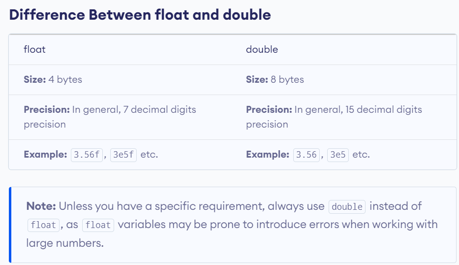

# Forks in the Road: Comparing, Deciding. 

## Introduction:
So far, the programs you ’ ve seen have been linear — each statement executes, in order, from top to bottom. However, to create interesting games, you need to write programs that execute (or skip) sections of code based on some condition. That ’ s the main topic of this chapter. Specifically, you ’ ll learn to:

- Understand truth (as C++ defines it) 
- Use *if* statements to branch to sections of code 
- Use *switch* statements to select a section of code to execute 
- Use *while* and do loops to repeat sections of code 
- Generate random numbers

## C++ float and double
In C++, both `float` and `double` data types are used for floating-point values. Floating-point numbers are used for decimal and exponential values. For example,

```c++
// creating float type variables
float num1 = 3.0f;
float num2 = 3.5f;
float num3 = 3E-5f; // 3x10^-5

// creating double type variables
double num4 = 3.0;
double num5 = 3.5;
double num6 = 3E-5; // 3x10^-5
```

We must add the suffix `f` or `F` at the end of a `float` value. This is because the compiler interprets decimal values without the suffix as `double`.

Consider this code.

```c++
float a = 5.6;
```

Here, we have assigned a `double` value to a `float` variable.

In this case, 5.6 is converted to `float` by the compiler automatically before it is assigned to the variable a. This may result in data loss.

<p align="center">

</p>

## Understanding Truth

Truth is black and white, at least as far as C++ is concerned. You can represent true and false with their corresponding keywords, `true` and `false` . You can store such a Boolean value with a `bool` variable, as you saw in Chapter 1, “ Types, Variables, and Standard I/O: Lost Fortune. ” Here ’ s a quick refresher:

```c++
bool fact = true, fiction = false;
```

This code creates two bool variables, fact and fiction . fact is `true` and fiction is `false` . Although the keywords `true` and `false` are handy, any expression or value can be interpreted as `true` or `false` too.

> 💡**Note :**
>
> Any non-zero value can be interpreted as `true` , while 0 can be interpreted as `false`.

A common kind of expression interpreted as `true` or `false` involves comparing things. Comparisons are often made by using built-in relational operators. Table lists the operators and a few sample expressions.

<p align="center">

</p>


## Using The if Statement

Okay, it ’ s time to put the concepts of true and false to work. You can use an `if` statement to test an expression for truth and execute some code based on it. Here ’ s a simple form of the `if` statement:
```c++
if(expression){
    statement;
}
```

If `expression` is `true` , then `statement` is executed. Otherwise, `statement` is skipped and the program branches to the `statement` after the `if` suite.

Here's an example combining the two:

```c++
#include <iostream>
using namespace std;
int main() {
  float x = 12.55f;
  float y = 13.3;  // well, ten-ish

  if (x > y)
  {
    cout << x << " > " << y <<"\n\n";
  }
  else
  {
    cout << x << " < " << y <<"\n\n";
  }
}
```
**By default 12.55 is treated as `double`; so to force the compiler to treat it as float, you need to write f at the end.**
