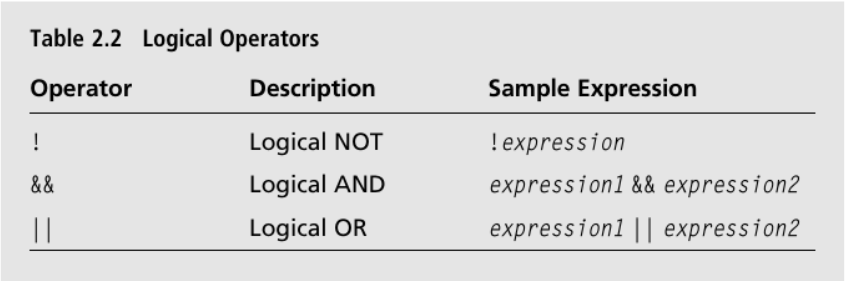

# Repetition: Doing Until it’s Done.

## Using while Loops 

`while` loops let you repeat sections of code as generic form of the while loop: while (expression) statement; long as an expression is `true`. Here’s a generic form of the `while` loop.

```c++
while(expression)
    statement;
```

If `expression` is `false` , the program moves on to the statement after the loop. If `expression` is `true` , the program executes `statement` and loops back to test `expression` again. This cycle repeats until `expression` tests `false`, at which point the loop ends.

## Samples
### [Play Again v1.0](./Samples/1.Play_Again_V1)
### [Sum of Positive Numbers](./Samples/5.Sum_of_Positive_Numbers)

## Using do Loops 

Like `while` loops, `do` loops let you repeat a section of code based on an expression. The difference is that a `do` loop tests its expression after each loop iteration. This means that the loop body is always executed at least once. Here ’ s a generic form of a `do` loop:

```c++
do
    statement;
while(expression)
```

The program executes **statement** and then, as long as **expression** tests `true`, the loop repeats. Once **expression** tests **false**, the loop ends.

## Samples
### [Play Again v2.0](./Samples/2.Play_Again_V2)

## Using break and continue Statements 

It ’ s possible to alter the behavior you ’ ve seen in loops. You can immediately exit a loop with the `break` statement, and you can jump directly to the top of a loop with a `continue` statement. Although you should use these powers sparingly, they do come in handy sometimes.

## Samples
### [Finicky Counter](./Samples/3.Finicky_Counter_V1)

## Using Logical Operators 

So far you ’ ve seen fairly simple expressions evaluated for their truth or falsity. However, you can combine simpler expressions with *logical operators* to create more complex expressions. Table lists the logical operators.

<p align="center">

</p>

## Samples
### [Designers Network Program](./Samples/4.Designers_Network_Program)