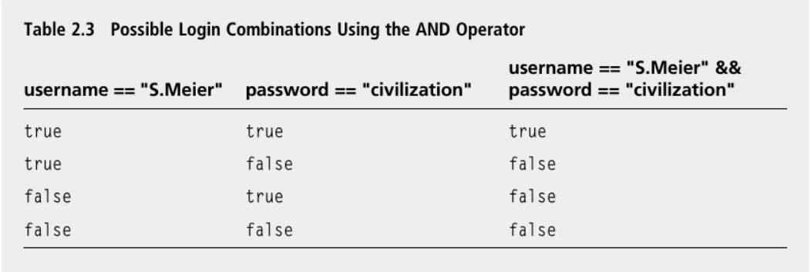
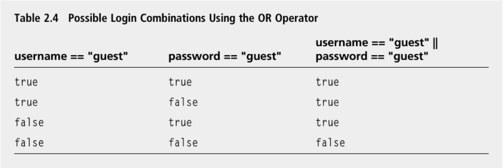
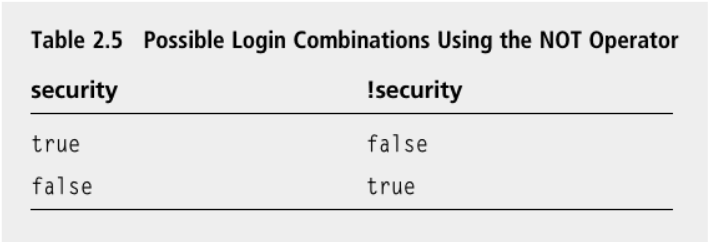

## Introducing the Designers Network Program 

The Designers Network program simulates a computer network in which only a select group of game designers are members. Like real-world computer systems, each member must enter a username and a password to log in. With a successful login, the member is personally greeted. To log in as a guest, all a user needs to do is enter `guest` at either the username or password prompt.

## Using the Logical AND Operator 

The logical AND operator, && , lets you join two expressions to form a larger one, which can be evaluated to `true` or `false` . The new expression is `true` only if the two expressions it joins are `true` ; otherwise, it is `false`. Just as in English, “and” means both. Both original expressions must be `true` for the new expression to be `true`. Here ’ s a concrete example from the Designers Network program: 
```c++
if (username == "S.Meier" && password == "civilization")
```

The expression `username == "S.Meier" && password == "civilization"` is `true` only if both `username == "S.Meier"` and `password == "civilization"` are `true` . 

This works perfectly because I only want to grant Sid access if he enters both his username and his password. Just one or the other won ’ t do. 

Another way to understand how && works is to look at all of the possible combinations of truth and falsity (see Table).

<p align="center">

</p>

Of course, the Designers Network program works for other users besides Sid Meier. Through a series of `if` statements with `else` clauses using the && operator, the program checks three different `username` and `password` pairs. If a user enters a recognized pair, he is personally greeted.

## Using the Logical OR Operator 

The logical OR operator, || , lets you join two expressions to form a larger one, which can be evaluated to `true` or `false` . The new expression is `true` if the first expression or the second expression is `true` ; otherwise, it is `false` . Just as in English, “or” means either. If either the first or second expression is `true` , then the new expression is `true` . (If both are `true` , then the larger expression is still `true`.) Here ’ s a concrete example from the Designers Network program:

```c++
else if (username == "guest" || password == "guest")
```

The expression `username == "guest" || password == "guest"` is `true` if `username == "guest"` is `true` or if `password == "guest"` is `true`. This works perfectly because I want to grant a user access as a `guest` as long as he enters guest for the username or password. If the user enters `guest` for both, that ’ s fine too.

Another way to understand how || works is to look at all of the possible combinations of truth and falsity (see Table). 

<p align="center">

</p>

## Using the Logical NOT Operator 

The logical NOT operator, ! , lets you switch the truth or falsity of an expression. The new expression is `true` if the original is `false` ; the new expression is `false` if the original is `true` . Just as in English, “not” means the opposite. The new expression has the opposite value of the original. 

I use the NOT operator in the Boolean expression of the `do` loop:
```c++
} while (!success);
```

The expression `!success` is `true` when `success` is `false`. That works perfectly because `success` is `false` only when there has been a failed login. In that case, the block associated with the `do` loop executes again and the user is asked for his username and password once more. 

The expression `!success` is `false` when `success` is `true` . That works perfectly because when `success` is `true` , the user has successfully logged in and the loop ends. 

Another way to understand how `!` works is to look at all of the possible combinations of truth and falsity (see Table)

<p align="center">

</p>

## Understanding Order of Operations 

Just like arithmetic operators, logical operators have precedence levels that affect the order in which an expression is evaluated. 

`Logical NOT, ! ,` has a `higher` level of precedence than `logical AND, && ,` which has a `higher` precedence than `logical OR, ||`. 

Just as with arithmetic operators, if you want an operation with lower precedence to be evaluated first, you can use `parentheses`. 

it ’ s best to try to create expressions that are clear and simple rather than expressions that require a mastery of the operator precedence list to decipher.