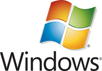
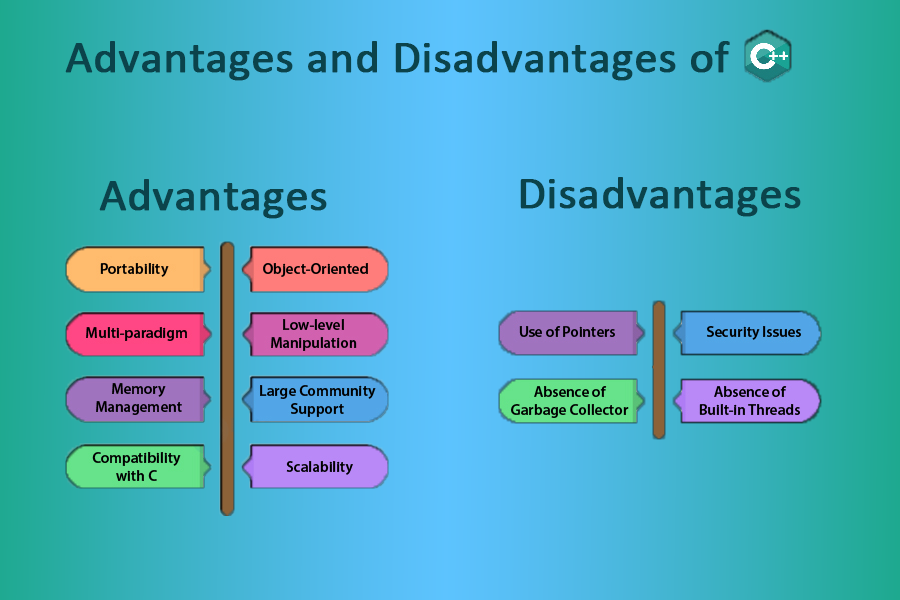
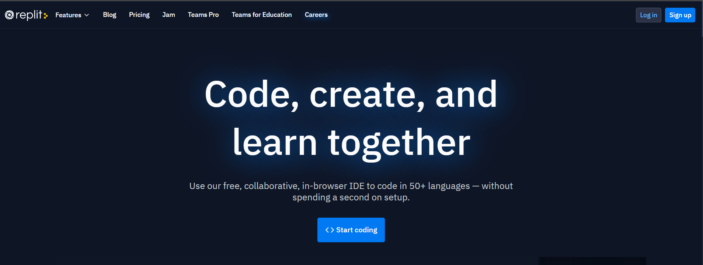
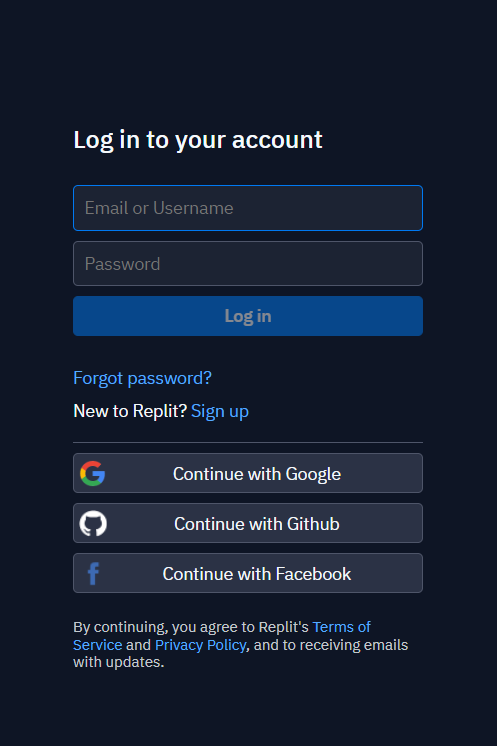
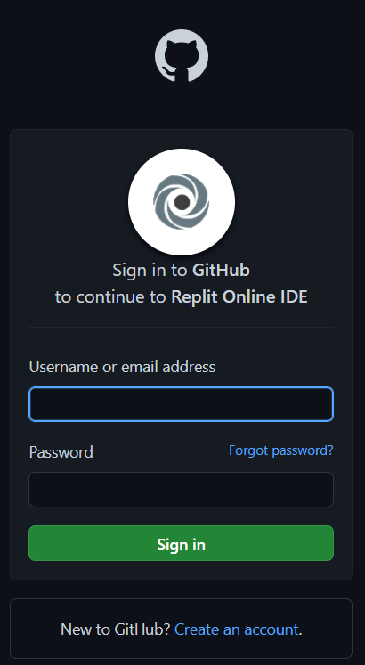
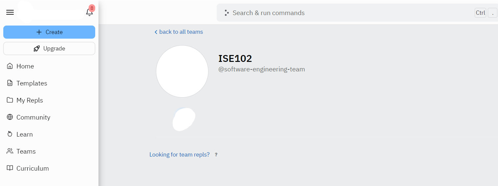

# IntroductionToSoftwareEngineering

This subject provides an introduction to the ideas and skills foundational to software engineering and will cover the fundamental concepts of programming with a particular focus on learning to use the C++ programming language. Students will gain an understanding of the basic ideas underlying programming and experience developing applications using an integrated development environment (IDE).

# Introducing C++
C++ is leveraged by millions of programmers around the world. It ’ s one of the most popular languages for writing computer applications — and the most popular language for writing big-budget computer games.

## What Is C++ Used For?[1]

### 1) Games

C++ is close to the hardware, can easily manipulate resources, provide procedural programming over CPU intensive functions and is fast. It is also able to override the complexities of 3D games and provides multilayer networking. All these benefits of C++ make it a primary choice to develop the gaming systems as well as game development suites

### 2) GUI Based Applications

C++ can be used to develop most of the GUI based and desktop applications easily as it has got the required features.

Most of the applications of the adobe systems including Illustrator, Photoshop, etc. are developed using C++.

### 3) Database Software

C++ is also used in writing database management software. The two most popular databases MySQL and Postgres are written in C++.

MySQL, one of the most popular database software that is used widely in many real-world applications is written in C++.

### 4) Operating Systems

The fact that C++ is a strongly typed and fast programming language makes it an ideal candidate for writing operating systems. In addition to this, C++ has a wide collection of system-level functions that also help in writing low-level programs.

Apple OS X has some of its parts written in C++. Similarly, some parts of the iPod are also written in C++.

Most of the software from Microsoft is developed using C++ (flavors of Visual C++). Applications like Windows 95, ME, 98; XP, etc. are written in C++. Apart from this, the IDE Visual Studio, Internet Explorer, Microsoft Office are also written in C++.

### 5) Embedded Systems

Various embedded systems like smartwatches, medical equipment systems use C++ to program as it is closer to the hardware level and can provide a lot of low-level function calls when compared to the other high-level programming languages.

## Advantages of C++ [2]

### 1. Portability 
C++ offers the feature of portability or platform independence which allows the user to run the same program on different operating systems or interfaces at ease. Suppose you write a program in LINUX OS and for some apparent reason you switch to Windows OS, you would be able to run the same program in windows as well without any error. This feature proves to be of great convenience to the programmer.
### 2. Object-oriented 
One of the biggest advantages of C++ is the feature of object-oriented programming which includes concepts like classes, inheritance, polymorphism, data abstraction, and encapsulation that allow code reusability and make a program even more reliable. Not only this, it helps us deal with real-world problems by treating data as an object. C lacked this feature and hence it was created, proving to be of great significance..
### 3. Low-level Manipulation 
Since C++ is closely associated with C, which is a procedural language closely related to the machine language, C++ allows low-level manipulation of data at a certain level. Embedded systems and compiler are created with the help of C++.
### 4. Memory Management 
C++ gives the programmer the provision of total control over memory management. This can be considered both as an asset and a liability as this increases the responsibility of the user to manage memory rather than it being managed by the Garbage collector. This concept is implemented with the help of DMA (Dynamic memory allocation) using pointers
### 5. Large Community Support 
C++ has a large community that supports it by providing online courses and lectures, both paid and unpaid. Statistically speaking, C++ is the 6th most used and followed tag on StackOverflow and GitHub.
### 6. Compatibility with C 
C++ is pretty much compatible with C. Virtually, every error-free C program is a valid C++ program. Depending on the compiler used, every program of C++ can run on a file with .cpp extension.
### 7. Scalability 
Scalability refers to the ability of a program to scale. It means that the C++ program is capable of running on a small scale as well as a large scale of data. We can also build applications that are resource-intensive.

Advantages and Disadvantages of C++ Programming

## Disadvantages of C++

### 1. Use of Pointers: 
Pointers are a relatively difficult concept to grasp and it consumes a lot of memory. Misuse of pointers like wild pointers may cause the system to crash or behave anomalously.
### 2. Security Issue 
Although object-oriented programming offers a lot of security to the data being handled as compared to other programming languages that are not object-oriented, like C, certain security issues still exist due to the availability of friend functions, global variables and, pointers.
### 3. Absence of Garbage Collector: 
As discussed earlier, C++ gives the user complete control of managing the computer memory using DMA. C++ lacks the feature of a garbage collector to automatically filter out unnecessary data.
### 4. Absence of Built-in Thread
C++ does not support any built-in threads. Threads is a relatively new concept in C++ which wasn’t initially there. Now, C++ is capable of supporting lambda functions.

## Creating an Executable File [3]

The file that you run to launch a program — whether you ’ re talking about a game or a business application — is an executable file . There are several steps to creating an executable file from C++ source code (a collection of instructions in the C++ language). The process is illustrated in

1. First, the programmer uses an editor to write the C++ source code, a file that usually has the extension .cpp . The editor is like a word processor for programs; it allows a programmer to create, edit, and save source code.
2. After the programmer saves a source file, he or she invokes a C++ compiler — an application that reads source code and translates it into an object file . Object files usually have the extension .obj .
3. Next, a linker links the object file to any external files as necessary, and then creates the executable file, which generally ends with the extension .exe . At this point, a user (or gamer) can run the program by launching the executable file.

To help automate this process, it ’ s common for a programmer to use an all-in-one tool for development, called an `IDE ( Integrated Development Environment )`. An IDE typically combines an editor, a compiler, and a linker, along with other tools.

## Dealing with Errors [3]
- **Compile errors**. These occur during code compilation. As a result, an object file is not produced. These can be syntax errors , meaning that the compiler doesn ’ t understand something. They ’ re often caused by something as simple as a typo. Compilers can issue warnings, too. Although you usually don ’ t need to heed the warnings, you should treat them as errors, fix them, and recompile.

- **Link errors**. These occur during the linking process and may indicate that something the program references externally can ’ t be found. These errors are usually solved by adjusting the offending reference and starting the compile/link process again.

- **Run-time errors**. These occur when the executable is run. If the program does something illegal, it can crash abruptly. But a more subtle form of run-time error, a logical error , can make the program simply behave in unintended ways. If you ’ ve ever played a game where a character walked on air (that is, a character who shouldn ’ t be able to walk on air), then you ’ ve seen a logical error in action.

# Introduction to Replit

Replit is a coding platform that lets you write code and host apps. It also has many educational features built-in, making it great for teachers and learners too.

## Learning Code: Replit for Students
If you're learning to code, whether as a self-taught programmer or as part of another course, you'll find our learning resources useful.

You can work through our [project-based tutorials](https://docs.replit.com/tutorials/00-overview) to learn how to code, or download them all as an [ebook](https://www.codewithreplit.com/).

If you're learning a specific language, we probably cover it in one of our teacher-contributed [open curricula](https://docs.replit.com/teaching-curriculum/intro-teaching-curriculum).

We also have a beginner-friendly [Discord server](https://discord.util.repl.co/join) where you can get (and give) help on nearly anything.

## How to Create Replit Accout

**Requirement**: Github account

First go to [replit.com](https://replit.com/)

In the main page click on log in on right top of the page : 

Then in the login page click on **Continue with Github**

After choosing **Continue with Github** account, the site redirect you to the github's login page: 

Write down your username and password in the form then click **Sign in**

> **Congratulation**
> 
> You have created a Replit account, now you can run and debug your codes.

Here is the class link at [replit](http://replit.com) :

> ***Note :**
> 
> Be sure to login with your github account first then continue:

https://replit.com/teams/join/nwwpztqgjgyjzklgfandtxqwxayfxihd-software-engineering-team

After click on link you'll join the **ISE102** class :

please submit your activity to improve your coding and join in team:

## Resources : 

1.https://www.softwaretestinghelp.com/cpp-applications/
2.https://pathapadha.pythonanywhere.com/articles/c++/i1002
3.Dawson, M. (2014). Beginning c++ through game programming. Cengage Learning.
